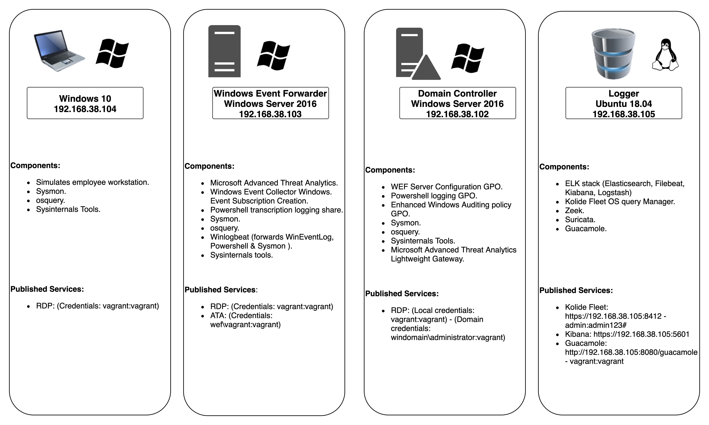

# DetectionLabELK
DetectionLabELK is a fork from Chris Long's [DetectionLab](https://github.com/clong/DetectionLab) with ELK stack instead of Splunk.

## Lab Information

* **Domain Name**: windomain.local
* **Windows Admininstrator login**: vagrant:vagrant
* **Fleet login**: https://192.168.38.105:8412 - admin:admin123#
* **Kibana login**: https://192.168.38.105:5601
* **Microsoft ATA login**: https://192.168.38.103 - wef\vagrant:vagrant
* **Guacamole login**: http://192.168.38.105:8080/guacamole - vagrant:vagrant

## Primary Lab Features:
* [Microsoft Advanced Threat Analytics](https://www.microsoft.com/en-us/cloud-platform/advanced-threat-analytics) is installed on the WEF machine, with the lightweight ATA gateway installed on the DC
* Windoes Evenet forwarder along with Winlogbeat are pre-installed and all indexes are pre-created on ELK. Technology add-ons for Windows are also preconfigured.
* A custom Windows auditing configuration is set via GPO to include command line process auditing and additional OS-level logging
* [Palantir's Windows Event Forwarding](http://github.com/palantir/windows-event-forwarding)  subscriptions and custom channels are implemented
* Powershell transcript logging is enabled. All logs are saved to `\\wef\pslogs`
* osquery comes installed on each host and is pre-configured to connect to a [Fleet](https://kolide.co/fleet) server via TLS. Fleet is preconfigured with the configuration from [Palantir's osquery Configuration](https://github.com/palantir/osquery-configuration)
* Sysmon is installed and configured using SwiftOnSecurity’s open-sourced configuration
* All autostart items are logged to Windows Event Logs via [AutorunsToWinEventLog](https://github.com/palantir/windows-event-forwarding/tree/master/AutorunsToWinEventLog)
* SMBv1 Auditing is enabled

## Requirements
* 55GB+ of free disk space
* 16GB+ of RAM
* Vagrant 2.2.2 or newer
* Virtualbox or VMWare Fusion/Workstation

## Deployment Options
### Local Deployment (using Vagrant) - ETA 90-120 minutes.
1.  **VirtualBox**
    * [Install Vagrant](https://www.vagrantup.com/downloads.html) on your system.
	 * [Install Packer](https://packer.io/downloads.html) on your system.
    * Download DetectionLabELK to your local machine by running `git clone https://github.com/cydefenders/DetectionLabELK.git` from command line OR download it directly via [this link](https://github.com/CyDefenders/DetectionLabELK/archive/master.zip).
    * `cd` to the Packer directory and build the Windows 10 and Windows Server 2016 boxes by executing `packer build --only=[vmware|virtualbox]-iso windows_10.json` and `packer build --only=[vmware|virtualbox]-iso windows_2016.json`
    * `cd` into the Vagrant directory: `cd ../Vagrant` and edit the `Vagrantfile`. Change the lines `cfg.vm.box = "detectionlabelk/win2016"` and `cfg.vm.box = "detectionlabelk/win10` to `cfg.vm.box = "../Boxes/windows_2016_<provider>.box"` and "`cfg.vm.box = "../Boxes/windows_10_<provider>.box"` respectively.
    * Install the Vagrant-Reload plugin: `vagrant plugin install vagrant-reload`.
    * Ensure you are in the base DetectionLabELK folder and run `./build.sh` (Mac & Linux) or `./build.ps1` (Windows).
    * Navigate to https://192.168.38.105:5601 in a browser to access the Kibana dashboard on logger.
    * Navigate to https://192.168.38.105:8412 in a browser to access the Fleet server on logger. Default credentials are admin:admin123#.

2.  **VMware Workstation & Fusion** [Requires VMware plugin $80](https://www.vagrantup.com/vmware/#buy-now)
    * [Install Vagrant](https://www.vagrantup.com/downloads.html) on your system.
	 * [Install Packer](https://packer.io/downloads.html) on your system.
    * Download DetectionLabELK to your local machine by running `git clone https://github.com/cydefenders/DetectionLabELK.git` from command line OR download it directly via [this link](https://github.com/CyDefenders/DetectionLabELK/archive/master.zip).
    * `cd` to the Packer directory and build the Windows 10 and Windows Server 2016 boxes by executing `packer build --only=[vmware|virtualbox]-iso windows_10.json` and `packer build --only=[vmware|virtualbox]-iso windows_2016.json`
    * `cd` into the Vagrant directory: `cd ../Vagrant` and edit the `Vagrantfile`. Change the lines `cfg.vm.box = "detectionlabelk/win2016"` and `cfg.vm.box = "detectionlabelk/win10` to `cfg.vm.box = "../Boxes/windows_2016_<provider>.box"` and "`cfg.vm.box = "../Boxes/windows_10_<provider>.box"` respectively.
    * Install the Vagrant-Reload plugin: `vagrant plugin install vagrant-reload`.
    * [Buy a license](https://www.vagrantup.com/vmware/index.html#buy-now) for the VMware plugin
    * Install it with `vagrant plugin install vagrant-vmware-desktop`.
    * License it with `vagrant plugin license vagrant-vmware-desktop <path_to_.lic>`.
    * Download and install the VMware Vagrant utility: https://www.vagrantup.com/vmware/downloads.html
    * Ensure you are in the base DetectionLabELK folder and run `./build.sh` (Mac & Linux) or `./build.ps1` (Windows).
    * Navigate to https://192.168.38.105:5601 in a browser to access the Kibana dashboard on logger.
    * Navigate to https://192.168.38.105:8412 in a browser to access the Fleet server on logger. Default credentials are admin:admin123#.

**Note**: Deployment logs will be present in the `Vagrant` folder as `vagrant_up_<host>.log`
